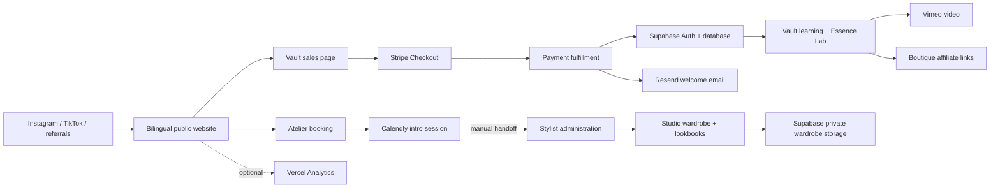

# AC Styling repository and ecosystem assessment

Assessed September 19, 2026 (America/New_York). Repository HEAD: `b13e922` on `main`. Evidence timestamps use UTC, September 20. This assessment includes the existing uncommitted legal-page work but does not modify it.

**Decision: hold the public Vault launch and prioritize database authorization immediately.** AC Styling has a coherent product, a workable architecture, and substantially improved application code. However, live database permissions still permit privilege escalation and other access-control failures. Payment fulfillment also has failure paths that can leave a paid buyer without access. The published flagship has no usable module video, and the catalog prices verified with the configured Stripe account are test-mode prices.

The July audit's statement that all P0/P1 issues are closed is not a reliable description of the current system. Several application-level fixes are real, but direct access to Supabase bypasses those application checks.

## Scope and evidence

Reviewed architecture, server actions, authentication, database privileges/policies/functions, storage, payment fulfillment, content readiness, public customer journeys, localization, accessibility, SEO, dependency security, CI, and operations.

Live database inspection used an explicit **read-only transaction**, collecting schema/configuration and catalog aggregates. Stripe checks retrieved catalog prices only. Browser checks visited public pages without logging in, submitting forms, uploading files, or creating checkouts. No production configuration or customer records were changed. Vulnerabilities were established from code and live permission definitions; no destructive exploitation or account takeover was attempted.

Evidence files:

- [Live database configuration and catalog readiness](assessment-database.json)
- [Public browser observations](assessment-public.json)
- [Targeted desktop/mobile and booking observations](assessment-ui.json)
- [Lint results](assessment-lint.json)
- [npm audit result](assessment-dependency-audit.json)
- [Mobile homepage capture](assessment-home-mobile.png)

Limits: no authenticated end-to-end purchase, refund, account deletion, or Studio workflow was exercised; no current Lighthouse/Core Web Vitals measurement; no verification of Vercel deployment settings, backup restoration, Vimeo account restrictions, Resend delivery configuration, or private social analytics. The configured Stripe account is test mode; production environment secrets were not inspected. Absence of monitoring/backup configuration in the repository is not proof that an external dashboard has none.

## Current condition

| Area | Assessment | Basis |
|---|---|---|
| Product and positioning | Coherent; content incomplete | Clear learner/client split, database-driven offers, explicit brand commitments |
| Architecture | Suitable for the business | Next.js monolith, domain actions, Supabase, static public pages |
| Database authorization | Critical | Live self-editable privilege flags; overbroad policies and privileged RPC grants |
| Payments and account claiming | Launch blocker | Fulfillment can silently fail; claim credential lifecycle is incomplete |
| Studio | Substantial functionality; isolation gaps remain | Private storage and note restrictions work, but token/path/claim boundaries need hardening |
| Public UX and accessibility | Mixed | Vault sales page is stronger; homepage controls and mobile menu still have defects |
| Localization | Partial parity | Marketing/Vault translations exist; password recovery and legal content remain uneven |
| Tests and CI | Good unit foundation; incomplete release assurance | 279 passing tests, no build/typecheck/E2E/database-policy gate in CI |
| Operations and deployment | Needs verification and repeatability | Shared production database, manual migrations, live/source drift |

Measured repository footprint: 207 TS/TSX/CSS files in `app`, `components`, `lib`, `utils`, and `i18n`; approximately 28,002 lines; 85 client-component files; 103 exported async action functions. Counts include the existing working-tree legal files. Live Supabase: 26 public tables, all with RLS enabled; 72 public/storage policies; 10 public functions; four storage buckets.

### Validation results

| Check | Result |
|---|---|
| Unit suite | **36 files, 279 tests passed** |
| ESLint | **0 errors, 159 warnings**; 118 unused-variable, 32 raw-image, 3 alt-text warnings, plus other smaller categories |
| TypeScript | `npx tsc --noEmit --incremental false` passed |
| Production build | Passed after allowing network access for Google Fonts; emitted a `metadataBase` fallback warning |
| Rendering | Marketing, booking, legal/auth forms, and Vault sales page prerender; authenticated Vault/Studio remain dynamic |
| Public browsing | Nine route checks completed without uncaught page JavaScript errors; protected content redirected to login |
| Existing Playwright suite | Reviewed, not executed as a suite; three public-access assertions contradict both source and observed production redirects |
| npm audit | Reported **0 vulnerabilities**; this conflicts with applicable maintainer advisories below and must not be treated as security clearance |

## Ecosystem and customer journeys

| Service / surface | Role | Verified state and operational implication |
|---|---|---|
| Vercel / Next.js | Hosting, rendering, caching | Live responses carry Vercel cache headers. Source and deployment differ; verify deployment SHA before declaring fixes shipped. |
| Supabase | Customer identity, content, entitlements, wardrobe data | Direct browser/API access is part of the security perimeter. RLS being enabled is insufficient when policies permit the wrong operation. |
| Stripe | Single courses and full/course passes | Colorimetry $50, Full Learning Access $150, Course Pass $50 match active USD prices and their linked products in the configured **test** account. No purchase was made. |
| Vimeo | Paid learning delivery | Five published modules all lack usable EN and ES video IDs under the null/empty/`TODO_FILL_IN` readiness check. Other stored IDs were not playback-tested. Domain restrictions remain unverified. |
| Resend | Authentication and purchase/support email | Templates and send paths exist. Failed welcome delivery is logged but has no durable retry queue. Sender-domain/DKIM/delivery status not inspected. |
| Calendly | Introductory booking | The live booking page loads Calendly and Stripe hosts before interaction. The new source consent gate is not reflected in that observed deployment. No Calendly webhook or automatic client-intake handoff was found. |
| Instagram / TikTok | Acquisition | Site links identify `ac.stylingcoach` and `ac.styling`. Reach, conversion, and audience size were not available. |
| Boutique | Affiliate discovery | Links, click tracking, collections, and saves exist. Database policies weaken both editorial integrity and click-data privacy. |
| Vercel Analytics | CTA measurement | No analytics script loaded on the inspected live pages. Code tracks CTA intent, not a verified purchase or completed booking funnel. |

The product's strongest distinction is the honest education/service boundary: the four color seasons online, individualized sub-season work in 1:1 services. The database-driven catalog and ban on invented proof are sound. The current public homepage nevertheless routes visitors almost entirely to services; the learner path is intentionally unlisted pending launch. Keep that restraint until delivery is ready, then expose a clear education/service choice without changing the established visual identity.

## Prioritized findings

### F01 — Critical: ordinary users can edit their own privilege and entitlement fields

**Live configuration confirmed.** The `profiles` UPDATE policy restricts the row to `id = auth.uid()` but does not restrict columns. `authenticated` has UPDATE privileges on `role`, `has_full_unlock`, `has_course_pass`, and `active_studio_client`. There are no non-internal triggers on `profiles` to protect these changes. A direct authenticated Supabase update can therefore change a normal user's row into an admin or paid-access profile. The hardened signup trigger does not prevent subsequent updates.

Evidence: [baseline policy](../supabase/migrations/00000000000000_baseline.sql#L2205), table grants around line 2808, and live `policies`, `columnPrivileges`, `triggers` in the database evidence.

**Remediation:** remove browser write privileges for privileged fields, including INSERT paths; allow only explicit profile-edit columns. Keep administrative/entitlement mutations behind trusted server code or narrowly authorized database functions. Audit existing privileged profiles and relevant logs after closing the path. Verify with real anon/user/admin database sessions in an isolated test project. This is a release blocker independent of whether Stripe is live.

### F02 — High: privileged clone and rate-limit functions are publicly executable

**Live configuration confirmed.** `clone_wardrobe_item`, `clone_lookbook`, and `check_rate_limit` run as SECURITY DEFINER and grant EXECUTE to PUBLIC/anon/authenticated. The clone functions lack caller authorization and accept source and destination IDs. This permits unauthorized cross-user copying when valid IDs are known; the legacy item function copies client and internal notes. Image visibility remains subject to storage policy, and private-note column restrictions still apply to reads, so this is not a claim that every copied image/private note becomes publicly readable.

The rate-limit RPC accepts the key, maximum, and interval from the caller. Direct calls can manipulate/reset or exhaust counters, undermining the application email limiter.

Evidence: baseline functions at lines 237, 335, and 142; grants at lines 2563–2592; live function definitions/privilege checks in the evidence.

**Remediation:** revoke PUBLIC as well as anon/authenticated EXECUTE for server-only RPCs. Remove unused legacy clone RPCs or enforce admin/ownership checks inside them. Fix search paths and restrict default function privileges. Test direct RPC access, not just Next.js action guards.

### F03 — High: policies named “admin” authorize every authenticated user

**Live configuration confirmed.** `boutique_collections` and `boutique_collection_items` have ALL policies checking only `auth.role() = 'authenticated'`. `boutique_clicks` uses the same condition for “admin read”; its authenticated INSERT policy also does not bind `user_id` to the caller. Users can alter collections and inspect or forge other users' click attribution directly through Supabase.

Evidence: [baseline](../supabase/migrations/00000000000000_baseline.sql) lines 2316, 2343, 2363; current policies are retained in the live evidence.

**Remediation:** make collection writes/admin analytics reads depend on a protected admin role. Bind click attribution to the authenticated user; keep only intentional anonymous inserts. Policy names should describe their actual predicates.

### F04 — High: public uploads and bucket limits remain too permissive

**Live configuration confirmed.** “Anyone can upload an avatar” permits INSERT for PUBLIC with only a bucket check. “Admins can upload assets” actually permits any authenticated account to insert into `vault-assets`. Both buckets are public. All four buckets have null bucket-specific MIME and file-size restrictions; service-wide limits may still apply.

**Impact:** unauthorized asset hosting, storage/egress abuse, and untrusted content under a trusted asset origin. The private wardrobe bucket is a meaningful improvement, but does not fix these other buckets.

**Remediation:** require owner-scoped authenticated avatar paths, actual admin authorization for Vault assets, and explicit per-bucket type/size policies. Separate public previews from paid downloads. Review existing objects and retention without deleting them blindly.

### F05 — High: payment fulfillment can report success without granting access

**Code confirmed.** `grantAccessForProduct` returns `true` after failed chapter/masterclass grant inserts and ignores profile-update errors. The webhook logs purchase insert errors or unmatched products and can still return 200. The event marker remains, so a retry is skipped. An abrupt termination after inserting the marker also leaves a permanently processed event without completed work. If an exception instead clears the marker after partial writes, purchases have no stored Stripe session/line-item key to make replay safe.

Evidence: [access logic](../app/lib/access-logic.ts#L62), [webhook](../app/api/webhooks/stripe/route.ts#L78), particularly purchase handling at line 184 and final 200 at line 361.

**Remediation:** persist a uniquely keyed fulfillment record with processing/completed/retry states; make each purchase/grant idempotent at the database boundary; treat required write failures as failures; mark completion only after grants commit. Decouple email/admin notification retries from financial fulfillment. Test failed grant writes, missing products, concurrent deliveries, interruption, and partial replay.

The webhook also lacks a `payment_status` check and handles only `checkout.session.completed`. If delayed payment methods are enabled, it can grant before settlement and ignores `checkout.session.async_payment_succeeded`. Refund/dispute events have no reconciliation path. Set the supported payment/refund behavior explicitly. [Stripe fulfillment guidance](https://docs.stripe.com/checkout/fulfillment).

### F06 — High: purchase-claim protection does not close after the email recovery path

**Code confirmed; takeover not attempted.** A recent paid Stripe session ID can set a password when `user_metadata.pending_password` is true. `claimPurchase` clears it, but `UpdatePasswordClient` only updates the password. A buyer who uses the emailed recovery link therefore leaves the session-ID claim path open for the remainder of its 24-hour window. The check and password update are also separate operations, so simultaneous claims are not atomically consumed.

Evidence: [claim action](../app/actions/vault/claim-purchase.ts#L122), [password form](../app/[locale]/(auth)/update-password/UpdatePasswordClient.tsx#L27), [guest account creation](../app/lib/guest-purchase.ts#L47).

`user_metadata` is user-editable and should not be the authoritative marker for this security decision. [Supabase documents that distinction](https://supabase.com/docs/guides/database/postgres/row-level-security).

**Remediation:** use a server-owned, short-lived, single-use claim credential bound to a purchase/account; atomically consume it; invalidate it on every password-establishment path. Keep email ownership verification as the stronger recovery path. Test recovery followed by claim and concurrent claims.

### F07 — High: SSRF validation checks only the initial destination

**Code confirmed.** `uploadRemoteImage` validates the original URL then uses default-following `fetch`. A public URL can redirect to a private destination without another check. The scraper likewise validates only the initial page while allowing redirects and browser subrequests. DNS is resolved for validation and again for the actual connection; it is not pinned. IPv4-mapped IPv6 normalization also defeats the dotted-decimal-only mapped-address regex.

Evidence: [remote upload](../app/actions/studio.ts#L202), [scraper](../app/actions/scraper.ts#L37), [URL guard](../app/lib/ssrf-guard.ts).

**Remediation:** prohibit or validate each redirect, cover canonical IP representations, enforce outbound destination controls/pinning, cap response size/time, and restrict scraper subrequests. Close the browser in `finally` on navigation failures. Severity is strongest for remote upload, which is available to ordinary authenticated users; the scraper is admin-gated.

### F08 — Urgent dependency upgrade: pinned Next.js falls within current advisory ranges

`next` and `eslint-config-next` are pinned to **16.1.3**. Despite npm audit reporting zero, primary maintainer advisories establish relevant exposure:

| Advisory | Relevance | Published fix |
|---|---|---|
| [Server Actions CPU denial of service](https://github.com/vercel/next.js/security/advisories/GHSA-m99w-x7hq-7vfj) | App Router plus Server Actions matches this application | 16.2.11 |
| [Null-origin Server Actions CSRF bypass](https://github.com/vercel/next.js/security/advisories/GHSA-mq59-m269-xvcx) | This app relies on Server Actions origin protection | 16.1.7 |
| [Windows-hosted remote code execution](https://github.com/vercel/next.js/security/advisories/GHSA-p293-qw3h-jr36) | Relevant to exposed Windows-hosted servers; not evidence of Windows production hosting on Vercel | 16.3.3 |
| [AVIF image-optimization remote code execution](https://github.com/vercel/next.js/security/advisories/GHSA-2xp9-vwfh-vxw4) | Version is affected; runtime exposure depends on the image-processing implementation/dependencies | 16.3.3 |

**Remediation:** upgrade to a currently supported patched version covering these advisories (the cited fixes require at least 16.3.3 on the 16.x line), align framework lint tooling, and rerun build/auth/image/checkout smoke checks. Verify deployed runtime and hosting mitigations; do not infer production RCE from the package version alone. Investigate the registry audit discrepancy rather than trusting its zero count.

### F09 — Launch blocker: the advertised course cannot yet be delivered

**Live data confirmed.** There are three masterclasses, one published; 20 chapters, five published. All five published chapters have missing/placeholder video IDs in both languages. Published Colorimetry and the two active offers resolve to correctly matched **test-mode** Stripe products/prices through the configured credentials.

The sales page is live and correctly sends `noindex, nofollow`; noindex does not prevent a person with the link from seeing the offer or using its purchase controls. The page currently promises a learning experience that the flagship modules cannot deliver.

**Remediation:** finish and play-test all published modules in both locales, configure Vimeo restrictions, establish canonical live Stripe products and webhook secrets, then run a controlled complete payment-to-playback journey. Do not lift noindex or promote the link until these acceptance criteria pass. Current live-mode server configuration remains unverified.

### F10 — Medium: guest-upload and wardrobe-claim boundaries need stronger invariants

`createWardrobeItem` accepts a valid wardrobe token plus any `filePath` without proving the path was issued for that wardrobe or that an upload exists. Tokens have active/archive checks and manual rotation, but no explicit expiry or per-token upload quota. `claimWardrobe` reads an unowned row then updates by ID without an atomic `owner_id IS NULL` condition; concurrent token holders can race. Token values are logged during onboarding.

Evidence: [guest item creation](../app/actions/wardrobes.ts#L212), [wardrobe claiming](../app/actions/wardrobes.ts#L448), [onboarding](../app/actions/onboarding.ts).

**Remediation:** bind upload paths to server-issued upload records, validate type/size/existence, add expiry and quotas, atomically claim once, and avoid logging bearer tokens. The current path flaw allows invalid/cross-wardrobe references; it does not by itself bypass owner-scoped image signing for a normal client.

### F11 — Medium: self-service account deletion is not a complete data lifecycle

`deleteAccount` assumes database cascades and calls only Auth user deletion. Live `user_progress.user_id` and `tailor_cards.last_updated_by` reference `auth.users` without cascading deletion. These references can block deletion when present. Wardrobe ownership uses SET NULL, and storage objects, notification metadata, and webhook payloads have separate retention needs.

Evidence: [account action](../app/actions/vault/account.ts#L18), live `foreignKeys` evidence.

**Remediation:** define a deletion/anonymization workflow covering relational data, stored objects, external processors, financial record retention, and retryable partial failure. Test it with a user who has course progress and wardrobe assets. Reconcile the implemented behavior with privacy copy; this assessment is an engineering consistency review, not a jurisdictional legal opinion.

### F12 — Medium: customer lookup and purchase restoration have hard scale limits

Both guest resolution and claiming scan at most ten pages of 200 Auth users. Accounts beyond that first 2,000-user window cannot reliably be found. `syncStripePurchases` scans only the latest 100 checkout sessions across the account, then grants through the ordinary user client; chapter/masterclass writes can be denied while the shared grant helper still reports success.

Evidence: [guest lookup](../app/lib/guest-purchase.ts#L71), [claim lookup](../app/actions/vault/claim-purchase.ts#L60), [purchase restore](../app/actions/commerce.ts).

**Remediation:** persist a normalized, indexed account/purchase mapping; use durable purchase IDs and authorized server-side recovery. Fix this in conjunction with F01/F05 so restoring legitimate entitlements does not depend on permissive profile writes.

### F13 — Medium: tests do not cover the system's most consequential boundaries

The 279 passing unit tests are valuable, but Supabase mocks cannot prove SQL grants, RLS, storage isolation, or transaction behavior. The workflow runs only unit tests and lint. There are no CI build, explicit typecheck, browser, or isolated database-policy checks. Existing E2E tests expect anonymous access to courses/services/boutique even though production redirects all three to login.

**Remediation:** fix stale route expectations; add a small authenticated role matrix against an isolated Supabase instance; add fulfillment failure/replay and claim-lifecycle tests. Require typecheck/build and high-value desktop/mobile browser journeys. Prefer these checks over increasing a raw test count or testing implementation details.

### F14 — Medium: deployed public experience lags source, with remaining accessibility defects

Live `/en/book` and `/es/book` still have the generic site title and no top-level H1, while current source provides localized metadata and booking content. A clean browser visit loads `assets.calendly.com`, `calendly.com`, and `js.stripe.com` before interaction, unlike the source consent gate. These observations indicate deployment/cache divergence; the exact cause was not established.

The homepage has seven unnamed carousel buttons (two arrows and five dots). At 360px its document width is 374px; at 390px the full capture is 404px. A 1440px desktop check has no document overflow. Pressing Escape leaves the mobile menu expanded; source also lacks a menu focus trap/restore. Vault sales pages showed no horizontal overflow, unnamed buttons, or missing image alt attributes in the limited checks.

**Remediation:** verify the production deployment SHA and cache state, then validate the intended booking consent and metadata. Label carousel controls, fix mobile overflow, and implement menu keyboard/focus behavior. Do not interpret these spot checks as a WCAG certification. Full-page captures include scroll-triggered sections before reveal, so their blank areas are not evidence that content is absent.

### F15 — Medium: bilingual parity and performance still need focused work

The password-update form is English-only, uses English toast messages, and redirects through a locale-less `/vault`. Privacy and terms remain English in the inspected source; the local refund translation work is in progress and preserved. Welcome email subject/body defaults are English. Translation JSON infrastructure is present, but not consistently used across the whole customer journey.

The homepage preloads both mobile and desktop hero images; hiding one with CSS does not establish responsive resource selection. Shared Framer Motion, full translation-message delivery, and large client components add weight. The previous handover's mobile score of 81 is historical, not a new measurement.

**Remediation:** finish the ES purchase/recovery/support/legal journey, then measure production LCP/INP/CLS and script costs. Use responsive image selection, reduce shared animation payload where measurements justify it, and limit translation payloads by surface. Maintain the shipped Antic Didone/Inter and taupe palette rather than introducing another brand system.

### F16 — Medium: recovery, observability, and migration repeatability are underdeveloped

The repository documents one shared production database and manually applied SQL. The July baseline is not a current snapshot; later migrations overlap it and migration 09 requires migration 10 to run first. The migrations README only inventories 01–05. This is useful change history, but not a rehearsed fresh-environment restoration process.

CSP remains report-only with unsafe script allowances and no reporting endpoint. Application logging exists, but no centralized exception integration or durable fulfillment/email retry worker was found. There are no `error.tsx`/`global-error.tsx` boundaries, and only one marketing loading file. The environment example documents only two public variables, omitting required operational settings and launch flags.

**Remediation:** create an isolated staging/test database, establish a deterministic migration/bootstrap order, refresh schema evidence, and rehearse restoration of database plus storage. Define alerting for paid-but-unfulfilled purchases and failed delivery, operator retry/reconciliation tools, and localized failure boundaries. Assign owners for backups, secrets, webhook settings, Vimeo restrictions, and release verification. Enforce CSP after measuring violations and testing integrations.

## What should be retained

The application does not need a rewrite or microservice split. Server Components plus domain actions fit this business. Explicit admin guards and Zod schemas are useful; extend them without relying on them as substitutes for database permissions. Private wardrobe storage, owner/admin signing, hidden internal-note columns, entitlement-gated video retrieval, verified Stripe signatures, static public rendering, locale routing, and reusable accessible modals are material improvements.

Keep the database-driven sales catalog, founding-offer record, restrained brand voice, and explicit separation of learner and personal-service intent. The remaining code-health work should target large business-critical modules: `VirtualWardrobe.tsx` (1,290 lines), `ChapterForm.tsx` (859), `wardrobes.ts` (736). Consolidate the two service-role client factories and add a server-only import boundary; generate database types when schema management is dependable. Remove stale scratch files such as tracked `lib/email-templates.ts.tmp` during a separate cleanup.

## Recommended sequence and acceptance criteria

| Order | Work | Completion evidence |
|---|---|---|
| **Immediate** | F01–F04 database privileges/RPCs/storage; F08 framework update | Ordinary users cannot change privilege flags or collections; anon cannot invoke privileged RPCs/upload arbitrary avatars; paid assets require intended roles; patched build deployed and identified |
| **Before accepting payment** | F05–F07 payment, claims, outbound fetch | Failed grants retry safely; concurrent/replayed events are idempotent; all password paths consume claim credentials; redirects/private destinations rejected |
| **Before promotion/indexing** | F09 content/payment readiness and F14 deployment reconciliation | Five real modules play in EN/ES; live product/price mappings verified; paid customer can claim, log in, play, and recover access; booking matches intended consent/metadata behavior |
| **Release assurance** | F10–F13 token lifecycle, deletion, restore, integration tests | Tests use real roles in an isolated environment; complete guest and returning-buyer flows; account deletion with realistic linked data; correct route expectations |
| **Following stabilization** | F15–F16 localization, performance, operations | ES journey review, fresh performance baseline, restore rehearsal, alerts/reconciliation, maintained environment/runbook documentation |

Engineering owns authorization, fulfillment, claims, tests, and deployment verification. Alejandra owns the authored videos, Spanish-first copy, authentic proof, and brand decisions. The account owner owns live Stripe configuration, Vimeo domain restrictions, and vendor access/operational settings. No new editorial/personalization feature should precede the immediate security and payment work.

Suggested business measurements after analytics is enabled: qualified visits by locale/source; Vault CTA to checkout to verified paid access; time from payment to first playable lesson; fulfillment/email failure rate; booking start to confirmed intro; Studio invitation to successful upload; course completion and support volume. These are proposed metrics, not existing performance claims. Validate revenue and conversion using real transactions rather than treating CTA clicks as sales.
