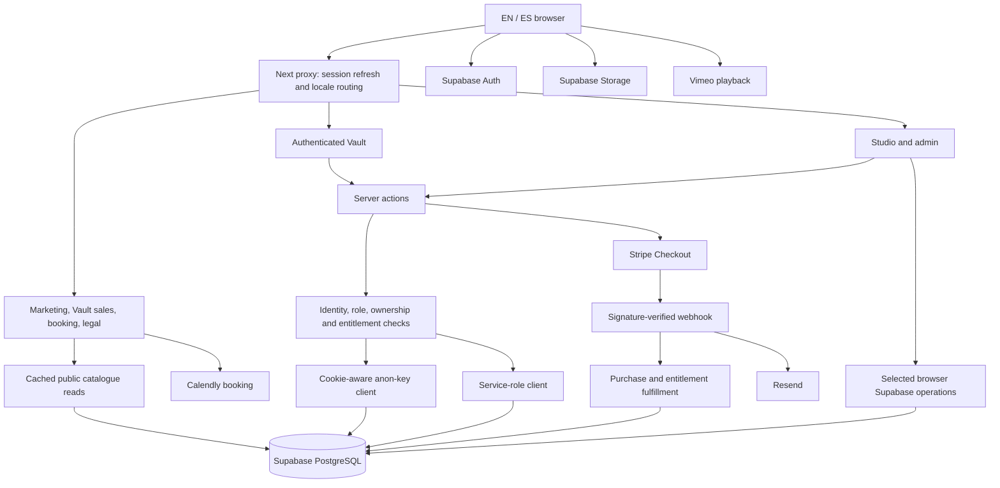

# Assess AC Styling launch readiness

> **AC Styling — Pre-Launch Engineering Assessment**

Assessment date: **September 25, 2026, America/New_York**
Final live-database observation: **September 26, 2026, 00:20:33 UTC**

**Launch recommendation: do not launch paid access yet.** The application has substantial implementation and meaningful automated tests, but authentication, payment recovery, authorization, content delivery, and release-baseline problems remain.

I made no application, configuration, documentation, or database changes. Live investigation used read-only transactions. Another process changed the repository and production schema during this assessment; those changes are explicitly distinguished below.

---

**1. Executive Summary**

AC Styling is an implemented Next.js/Supabase application, with considerably more engineering maturity than its July audit describes. It has guarded server actions, protected entitlement fields, private wardrobe storage, Stripe signature verification, durable fulfillment records, database authorization tests, bilingual routing, and backup tooling.

However, the current claim in `ROADMAP.md` that “the code is launch-ready” is not supported.

The most consequential findings are:

| Finding | Evidence and consequence |
|---|---|
| Authentication emails target a nonexistent route | Four auth actions generate `/auth/confirm` redirects. Production returned **404** there; `/en/confirm` returned **200**. |
| A public signup action can confirm an existing unverified account | `signUpWithMagicLink()` uses privileged `email_confirm: true` before mailbox possession is established. This undermines the verified-email trust boundary. |
| Ordinary authenticated users can modify public trust logos | Live privileges permit INSERT/UPDATE/DELETE on `trusted_by_logos`; its “admin write” policy checks only `auth.role() = 'authenticated'`. |
| Email failures can be reported as successes | `sendEmail()` treats a resolved Resend response as success without checking its `error` property. |
| Payment fulfillment is not crash-atomic | Entitlement extension and fulfillment completion are separate writes. A crash between them permits another extension on retry. |
| Guest onboarding can disappear after a failed first delivery | The purchase claim is created after fulfillment and only when that delivery created the account. A retry sees an existing account and can skip claim creation permanently. |
| Paid content cannot presently be delivered | Live inspection found **25 chapters, all unpublished, all `pending_video`, and no Spanish video IDs**. Nevertheless, Colorimetry is published and the Masterclass Pass is active. |
| Current source does not pass release gates | **743 tests passed**, but type checking and the production build failed on four errors in the wipe test, now committed. |
| Production changed during the assessment | Migrations 22–25 were initially absent. Their structural effects were present at the final read-only check. Their deployment history and post-application behavior were not verified by this assessment. |
| Internal documentation materially disagrees | Lifetime versus annual access, headline offer, catalogue counts, database freshness, test counts, and launch readiness conflict across active documents. |

No production compromise or customer-loss incident was demonstrated. Several failure paths are supported directly by code or live privilege definitions and should be resolved before accepting real payments.

---

**2. Baseline Identification**

The assessment encountered a moving baseline.

| Field | Observation |
|---|---|
| Repository | `C:\Users\magom\Dev\AC-STYLING` |
| Branch | `main` |
| Initial commit | `5c74e0b209e21f27bef12c39be615537d126d657` |
| Initial working tree | Untracked `scripts/wipe/`, `scripts/wipe_users.mjs`, and `tests/integration/wipe-users.test.ts` |
| Later commit | `9b780eb36e3d2e2d7dcbf75588f9530bc0e5c386` |
| Commit change | Added those three wipe-related files; no application changes between the two commits |
| Last observed working tree | Modified baseline SQL and untracked `scripts/_apply_22_25.tmp.mjs`, introduced outside this assessment |
| Observed working baseline SHA-256 | `94DC4804451DBC4DBE31F9265E7207C11AF98B83AB4C8A6714EF4DC94AE1B85E` |
| Application version | `0.1.0` |
| Local runtime | Node `20.19.4`, npm `10.8.2` |
| Deployment | Vercel, documented deployment from `main` |
| Database approach | Supabase-managed schema; deliberate manual SQL application, not automatic CLI migrations |
| Live verification | PostgreSQL catalogue, privileges, policies, function bodies, constraints, buckets, and selected aggregate content/payment information |
| External verification | Read-only production HTTP requests; retrieval of six distinct mapped Stripe prices using the local test key |
| Source changes by this assessment | None |

Resolved dependency versions include:

| Dependency | Version |
|---|---:|
| Next.js / React | `16.3.5` / `19.2.3` |
| TypeScript | `5.9.3` |
| Supabase JS / SSR | `2.91.1` / `0.8.0` |
| Stripe / Resend | `20.2.0` / `6.17.2` |
| next-intl / Vimeo player | `4.13.2` / `2.30.1` |
| Vitest / Playwright | `4.1.11` / `1.58.1` |
| ESLint / PGlite | `9.39.2` / `0.5.8` |
| Puppeteer | `25.11.0` |

**Runtime discrepancy:** Puppeteer declares Node `>=22.12.0`; local execution and CI use Node 20. Next itself requires at least Node `20.9.0`, more specific than README’s “Node 20+.”

Checks actually executed:

- `npm run lint`: **passed, 149 warnings**.
- `npm run test:run`: **66 files, 743 tests passed**.
- Type checking without incremental output: **failed, four errors**.
- Production build with dummy integration credentials: compilation succeeded; **type checking failed**.
- `npm audit --omit=dev --json`: **zero reported production dependency vulnerabilities**.
- Read-only live database and Stripe checks.
- Public production HTTP checks.

Not executed:

- Authentication, payment, refund, email, upload, deletion, or booking mutations.
- Production authorization probes that insert or update fixtures.
- Full Playwright suite, real video playback, or authenticated browser journeys.
- Backup/restore commands, migrations, seeds, repair scripts, or wipe commands.
- A second complete test/build run after the externally modified baseline SQL.
- Verification of Vercel’s deployed commit, environment settings, branch protection, Hermes scheduling, or R2 recovery.

The results therefore identify specific observed states, not an immutable production release.

---

**3. Product & System Architecture**

The application is an App Router monolith. That architecture remains appropriate.



Important implementation boundaries:

- `app/[locale]`: pages, layouts, metadata, and route-level composition.
- `app/actions`: public server-action entry points and most domain operations.
- `app/lib`: entitlement, fulfillment, claim, validation, catalogue, and security helpers.
- `utils/supabase`: browser, cookie-aware server, and two privileged client factories.
- `components`: substantial client-side interaction, including direct database/storage access.
- `supabase/migrations`: a public-schema snapshot plus historical change files.
- `scripts`: administrative tools, some destructive despite benign names.
- `tests`: mocked unit/component tests and isolated PostgreSQL authorization tests.

Public catalogue caching is deliberately cookieless. Viewer caching uses React request memoization. I found no evidence of private user data being deliberately placed in a shared public cache.

Structural weaknesses are concrete:

- Authorization is distributed across actions, direct browser operations, column grants, and RLS.
- Legacy profile linking appears in multiple auth/onboarding paths.
- Storage ownership and relational ownership can change separately.
- Some UI handlers report success without confirming that a row changed.
- Database interfaces are manually maintained rather than generated from a verified schema.

These call for incremental consolidation after behavioral tests, not a rewrite.

---

**4. Functional Capability Inventory**

Routes below are relative to `/{locale}`, except `/api/*` and `/auth/callback`.

| Surface | User and authorization | Implementation / dependencies | Assessment |
|---|---|---|---|
| `/` | Public | Marketing components; cached trust logos; translations | Implemented; public trust-logo write boundary defective |
| `/vault-access` | Public | `vault-catalog.ts`, offer selection, checkout actions, analytics | Implemented acquisition surface; not ready to sell deliverable content |
| `/book` | Public | Consent-gated Calendly embed and translated explanatory content | Implemented external booking handoff |
| `/legal/{terms,privacy,refunds}` | Public | Separate EN/ES content and metadata | Implemented; policy/copy review remains separate |
| `/login`, `/signup`, `/confirm`, `/forgot-password`, `/update-password` | Public/auth lifecycle | Supabase password, magic-link, OAuth and recovery flows; Resend | Implemented with critical route and verification inconsistencies |
| `/welcome` | Paid-session bearer credential | Stripe session verification; purchase claims | Implemented; retry and claim-lifecycle gaps |
| `/vault/join` | Signup journey | `JoinClient`, seamless signup | Implemented; shares auth-email defects |
| `/vault` | Session required | Viewer, editorial dashboard, progress, renewal banner | Implemented; authenticated does not mean paid |
| `/vault/foundations` | Session; item/pass gates | Masterclasses, chapters, profile flags, progress | Implemented catalogue; publication enforcement incomplete |
| `/vault/foundations/masterclass/[id]` | Session; entitlement for learning access | `checkAccess`, teaser, module list, resources | Implemented; published parent can have no playable modules |
| `/vault/foundations/[slug]` | Session + entitlement for video | Chapter reads, video action, progress/lab UI | Implemented; unavailable content produces weak playback state |
| `/vault/courses` and `/[slug]` | Session; course/item access | Standalone chapters and Course Pass | Implemented; no published playable courses |
| Chapter `/essence-lab` routes | Session + page entitlement gate | `EssenceLab`, response actions, progress | Implemented; direct response writes lack equivalent content validation |
| `/vault/essence` | Session; journal visibility logic | `essence_responses`, chapter question definitions | Implemented reflective journal, not a separate journal datastore |
| `/vault/profile` and `/style-card` | Current user | Profile, tailor card, essence and journey aggregation | Implemented |
| `/vault/boutique` | Session; release flag/admin exception | Brands, items, collections, saves | Implemented but intentionally closed for ordinary users by default |
| `/vault/services` | Session | Services, recommendations, Stripe checkout | Implemented; live service copy remains placeholders |
| `/vault/studio` | Admin | Stylist dashboard, wardrobes, inbox, lookbooks, tailor cards | Substantial implementation; ownership/lifecycle gaps |
| `/vault/my-studio` | `active_studio_client` | Own wardrobe, measurements and published lookbooks | Implemented; first-wardrobe and deletion edge cases |
| `/studio/upload/[token]` | Bearer token; expiry/status checks | Signed upload URL → storage → item registration | Implemented; some token issuance and quota gaps |
| `/vault/admin` | `profiles.role = 'admin'` | Catalogue, offers, services, clients, boutique, logos | Implemented; no comprehensive browser regression coverage |
| `/auth/callback` | Supabase authorization code | Exchange, safe next path, legacy linking/wardrobe claim | Implemented; unrelated to missing `/auth/confirm` |
| `/api/webhooks/stripe` | Valid Stripe signature | Paid-state checks, fulfillment, notifications, claims/email | Implemented with non-atomic recovery gaps |
| `/api/boutique/track` | Public | Validates target URL, records click, redirects | Implemented; GET has a database write side effect |

No customer billing portal or recurring subscription-management workflow was found. Annual access is sold through one-time payment sessions with application-managed renewal pricing.

---

**5. Critical User Journey Assessment**

**Vault purchase and learning**

The implemented path is:

`/vault-access` → Stripe Checkout → signed webhook → user resolution → fulfillment claim → purchase → entitlement → fulfillment completion → guest claim/email → `/welcome` → authentication → gated content.

Positive protections:

- Webhook signatures are checked.
- Delayed payment completion is handled separately from unpaid checkout completion.
- Per-line-item fulfillment records coordinate webhook and restore paths.
- Failed product lookups and grant writes can cause retryable failures.
- Purchase rows have line-item uniqueness.
- Chapter video columns are unavailable to ordinary database clients.

Remaining failures:

1. Checkout accepts a caller-supplied Stripe price without resolving it through the current sellable catalogue.
2. Grant extension and fulfillment completion are separate commits.
3. A newly created guest can lose claim/email setup after an intervening fulfillment failure.
4. Resend rejection can be misreported as delivery success.
5. Auth emails can return to a 404.
6. Restore scans only the latest 100 checkout sessions across the account.
7. A success toast can say “Content Unlocked” when restore reports no new purchases.
8. Content is currently unplayable.
9. Refund/dispute handling records a review task but does not change purchase status or revoke access.

**Renewal**

Pricing uses the original non-renewal purchase, renewal count, expiry, and a 30-day pricing grace window. Legacy null expiries preserve perpetual access.

Two unresolved model problems:

- Three profile-level passes share one expiry and renewal counter.
- Renewal resolves inactive offers through the caller’s RLS client, but ordinary users can read only active offers.

Single-item renewal also selects the earliest-expiring grant without allowing the user to choose another entitlement. An old lapsed grant can obstruct renewal of a different current item.

**Studio intake and delivery**

The principal intake path creates a wardrobe rather than a fake profile, issues a token, uploads directly to private storage, registers an item, and later assigns or claims the wardrobe.

Token lookup, path scope, object existence, and claim ownership have meaningful checks. Nevertheless:

- `createWardrobe()` and `getMyWardrobe()` omit token expiry when inserting a wardrobe.
- Assignment updates wardrobe, profile, and item ownership separately.
- Owned image paths may still belong to a former owner after reassignment.
- Deletion does not comprehensively remove nested/intake storage objects.
- Multiple active wardrobes can make `.single()` fail and trigger another wardrobe creation.

**Atelier booking**

`/book` delegates availability, reservation, and confirmation to Calendly. There is no local appointment table or booking webhook.

Service purchases inside the Vault are a different workflow: payment and an admin notification, followed by human service delivery. The system does not establish that buying a service reserves a calendar slot.

---

**6. Authentication & Authorization Assessment**

The effective role model is simpler than the documentation’s tier ladder:

- Supabase unauthenticated visitor.
- Supabase anonymous authenticated user.
- Normal authenticated user.
- Admin, determined by `profiles.role`.
- Independent Studio access flag.
- Independent learning pass flags and per-item grants.

“Guest,” “Member,” “Student,” and “Super User” are presentation/domain descriptions, not separate database roles.

| Boundary | Current protection | Remaining concern |
|---|---|---|
| Vault navigation | Proxy calls `getUser()` | Session presence is not a paid entitlement; anonymous Auth users also have sessions |
| Admin pages/actions | Server role checks | Direct PostgREST access must independently be safe |
| Profile privileges | Column write allowlist | Live checks confirmed ordinary users cannot update role/full-access fields |
| Chapter video | Caller identity → `check_access` → privileged column read | Publication state is not checked in the video action |
| Studio clients | Profile flag, ownership checks, RLS | Read-then-service-write ownership transitions need transactional treatment |
| Intake | Bearer token and wardrobe lookup | Reusable token; null expiry is accepted indefinitely |
| Purchase claim | Service-only table and atomic consume | Password change and closing other claims remain separate operations |
| Storage | Private wardrobe bucket and ownership function | Relational reassignment does not necessarily relocate object ownership |
| Privileged clients | Server usage and guards | Factories lack explicit `server-only` module enforcement |

The final live check confirmed:

- `check_access` now restricts requests to the caller, with a service-role exception.
- Anonymous execution of `check_access` is revoked.
- `get_user_role` now restricts cross-user lookup.
- Wardrobe insertion now checks wardrobe ownership.

Those structural changes occurred during this review. This assessment did not execute post-change role-based mutation tests against production.

The most urgent remaining auth findings are the premature email confirmation, missing confirmation route, and incomplete closure of purchase claims.

---

**7. Database Assessment**

**Live database state was inspected read-only.** This is not a claim that all production behavior or external Auth configuration was verified.

There are **28 public tables**, all with RLS enabled. `purchase_claims` and `fulfillments` also force RLS and are reserved for service-role access.

The database expectation model is:

| Domain | Tables | Important relationships and application expectations |
|---|---|---|
| Identity | `profiles` | PK/FK to `auth.users`; role, contact information, language, Studio flags, pass flags, shared expiry/count |
| Wardrobe ownership | `wardrobes` | Nullable owner FK to profiles; unique token; status; nullable expiry |
| Garments | `wardrobe_items` | Nullable user and wardrobe FKs; image URL; public/client/private notes; curation status; boutique link |
| Styling measurements | `tailor_cards` | Unique user; JSON measurements; stylist attribution |
| Lookbooks | `lookbooks`, `lookbook_items` | Wardrobe/user ownership; publication status; both JSON canvas items and relational items |
| Education | `masterclasses`, `chapters` | Parent/standalone structure; localized text; video identifiers; JSON questions/resources; publication and Stripe mappings |
| Learning state | `user_progress`, `essence_responses` | User-scoped progress strings; chapter/masterclass answers; JSON response values |
| Commerce | `offers`, `services`, `purchases` | Product/price mappings; displayed price text; Studio unlock flag; payment amount/currency and renewal marker |
| Entitlements | `user_access_grants` | Exactly one target: chapter, masterclass, or offer slug; expiry/count; per-item uniqueness now present live |
| Fulfillment | `fulfillments`, `stripe_processed_events`, `webhook_events` | Per-line-item state; event receipt records; detailed processing logs |
| Account claiming | `purchase_claims` | Unique checkout session; user/email; expiry and consumption state |
| Support | `user_questions`, `admin_notifications` | Question/answer state; notification reference uniqueness; PII-bearing metadata |
| Boutique | `partner_brands`, `boutique_items`, `boutique_collections`, `boutique_collection_items`, `boutique_saves`, `boutique_clicks` | Brand/items, curated collections, user saves, click attribution |
| Marketing | `trusted_by_logos` | Public logo catalogue |
| Abuse control | `rate_limits` | Atomic fixed-window email/IP counters |

Other schema objects:

- **10 public functions:** `can_access_wardrobe_object`, `check_access`, `check_rate_limit`, `check_wardrobe_eligibility`, `clone_lookbook`, `clone_wardrobe_item`, `get_user_role`, `handle_new_purchase`, `handle_new_user`, `handle_updated_at`.
- **63 public policies** in the inspected snapshot.
- Public update triggers, purchase fulfillment trigger, and an Auth user-creation trigger.
- No public views or materialized views were found.
- Important statuses are generally text plus CHECK constraints, rather than application-specific PostgreSQL enums.
- Four storage buckets: `avatars`, `boutique`, `studio-wardrobe`, `vault-assets`.
- All four have 15 MiB limits. The wardrobe bucket is private; the others are public. Vault assets permit PDFs/ZIPs as well as images.

Data-model concerns:

- `user_progress.content_id` mixes content identifiers and events such as `lab_unlocked:*`; it has no content FK.
- Both `lookbook_items` and JSON `lookbooks.lookbook_items` represent lookbook contents.
- `wardrobe_items.user_id` and `wardrobes.owner_id` duplicate ownership and can disagree.
- Pass flags share one expiry/count even though products are distinct.
- Stripe product identifiers have no cross-table uniqueness authority.
- `offer_slug` is not an FK to offers.
- Chapter parent/standalone consistency is not enforced by a CHECK.
- Mixed-case garment statuses remain accepted.
- Financial records cascade on account deletion; retention semantics require an explicit business decision.
- Several frequently filtered lookbook/entitlement relationships need an index review as usage grows.

Manual interfaces in `app/lib/types.ts` omit newer fields in some types, including profile access-term and wardrobe token-expiry fields. Supabase clients are not parameterized with a generated canonical `Database` type.

---

**8. Migration Assessment**

There are **26 SQL files: one baseline and 25 numbered changes**.

The baseline is a snapshot, not the first step of a replayable migration chain. It overlaps the dated files. Applying every file in filename order is unsafe.

The ledger below distinguishes structural evidence from proof that a historical SQL file ran unchanged.

| File / sequence | Purpose and lineage | Assessment |
|---|---|---|
| `00000000000000_baseline.sql` | Public schema, functions, policies, constraints, grants | Committed version matched the pre-22–25 state; working version changed during assessment |
| `20260710_01_harden_handle_new_user.sql` | Fix role assignment from user metadata; Auth trigger | Current function supports hardening; do not replay optional historical data operations |
| `20260710_02_restrict_partner_brands_read.sql` | Column-level protection for partner PII | Reflected in schema; coordinated explicit-column reads required |
| `20260710_03_lock_studio_wardrobe_bucket.sql` | Make bucket private; authenticated policies | Ownership model superseded by 07 |
| `20260710_04_email_rate_limits.sql` | Counter table and RPC | RPC privileges subsequently hardened by 12 |
| `20260710_05_stripe_processed_events.sql` | Event receipt table | Still used; now a receipt record, not the fulfillment gate described in older docs |
| `20260711_06_lookbooks_canvas_columns.sql` | Canvas JSON, thumbnail and backfill | Creates dual JSON/relational representations |
| `20260711_07_owner_scope_studio_wardrobe.sql` | Owner/admin object policy function | Present; storage policies are outside the public-only baseline |
| `20260715_08_private_internal_note.sql` | Column restrictions on garment private notes | Requires privileged guarded admin reads |
| `20260911_10_catalog_publication.sql` | Publication/date/runtime metadata and data updates | Must precede **09**, despite filename order |
| `20260911_09_chapter_video_entitlement.sql` | Restrict video columns | Depends on 10’s columns; quiz/resource data intentionally remains public |
| `20260911_11_founding_cohort_grants.sql` | Offer-target grants and uniqueness | Adds third grant target; does not provide unique item grants |
| `20260919_12_authorization_boundaries.sql` | Profile privileges, RPC ACLs, boutique/storage policies | Structural protections verified; omitted trust-logo policy |
| `20260920_13_purchase_claims.sql` | Server-only claim credentials | Table/constraints present; lifecycle correctness depends on code |
| `20260920_14_fulfillments.sql` | Durable fulfillment and purchase line-item uniqueness | Present; does not make entitlement and completion atomic |
| `20260920_15_account_deletion.sql` | FK cascade corrections and orphan cleanup | Includes data deletion; docs acknowledge committed SQL differs from originally applied guard |
| `20260920_16_intake_token_expiry.sql` | Expiry column and existing-token backfill | Column present; not all later insert paths supply expiry |
| `20260920_17_catalog_data_repair.sql` | Fix question keys and contradictory module flags | Data patch; live contradictory-module count was zero |
| `20260921_18_rename_style_essence.sql` | Guarded title rename | Live title matches; not a generally replayable migration |
| `20260921_19_masterclass_pass.sql` | Masterclass pass flag and access branch | Access function later replaced by 21 and 22 |
| `20260922_20_masterclass_resources.sql` | Masterclass downloadable resources | Publicly readable column; application gate alone does not protect URLs |
| `20260924_21_access_term.sql` | Annual terms, renewal counts and expiry enforcement | Present; superseded function body in 22 |
| `20260925_22_check_access_boundaries.sql` | Caller scoping and stricter standalone test | Absent initially; structural effect verified at final live check |
| `20260925_23_grant_uniqueness_and_studio_unlock.sql` | Item-grant unique indexes; service product matching | Absent initially; indexes and trigger-function change verified finally |
| `20260925_24_wardrobe_item_insert_scope.sql` | Owner-scoped member inserts | Old policy observed initially; corrected policy observed finally |
| `20260925_25_get_user_role_caller_only.sql` | Restrict role lookup to caller | Old function observed initially; corrected function observed finally |

Migration risks:

- The July reset removed the original reconstructive history.
- Dated SQL combines schema changes, security changes, backfills, and one-off content repairs.
- Some files intentionally refuse reapplication.
- Snapshot plus history is not a clean installation recipe.
- Public-only snapshotting excludes storage policies/buckets and the Auth trigger attachment.
- Historical apply records are uneven.
- Migration 15’s edited-after-application history prevents treating its current checksum as proof of what originally ran.

The externally regenerated working baseline retained 28 tables, 10 functions, and 63 policies. Grant/revoke statement counts changed from **203/3** to **202/4**, consistent with the observed access-function ACL change. These counts are not a substitute for full semantic diff approval.

---

**9. Database Reconciliation / Baseline Plan**

The three-way comparison is:

| Comparison | Result |
|---|---|
| Migration-derived state vs application | Current entitlement code expects 23’s uniqueness and product matching; historical files alone are not replayable from empty |
| Initial live vs committed snapshot | All ten inspected public function bodies matched after CRLF normalization; relevant columns/policies also aligned with the pre-22–25 state |
| Initial live vs proposed 22–25 state | Four known differences were present |
| Final live vs application expectations | Those four structural differences were closed during the review |
| Final live vs committed repository | Commit `9b780eb` still contained the older snapshot at the last observed comparison |
| Final live vs working snapshot | Targeted changes align; full canonical equivalence and post-change behavior remain unverified |
| Storage/Auth configuration vs public snapshot | Incomplete coverage by design |

Recommended safe sequence, **not executed here**:

1. Establish a change cutoff and identify the application deployment serving production.
2. Record migration 22–25 application times, checksums, deployment prerequisites, and recovery artifact.
3. Capture an authorized read-only schema reference covering public objects, grants/default privileges, storage policies/bucket settings, and relevant Auth trigger definitions.
4. Compare that reference against both the committed snapshot and each historical delta.
5. Classify every delta as reflected, absent, superseded, data-only, or uncertain.
6. Preserve historical files. Do not rewrite their history to imply a clean replay.
7. Create an approved baseline for **new isolated environments**, separate from historical change records.
8. Prove installation into a disposable Supabase-compatible environment.
9. Generate TypeScript database types from that approved state.
10. Add drift checks and role tests before permitting future production changes.

Read-only verification should use a dedicated read-only connection and explicitly establish:

```sql
BEGIN READ ONLY;
SET LOCAL statement_timeout = '15s';

SELECT current_setting('transaction_read_only');

-- Inspect:
-- information_schema.columns
-- pg_constraint / pg_indexes
-- pg_proc with pg_get_functiondef(...)
-- pg_trigger with pg_get_triggerdef(...)
-- pg_policies
-- role_table_grants / role_column_grants
-- pg_default_acl
-- storage.buckets, excluding customer object contents

ROLLBACK;
```

Do not invoke an application RPC merely because its name sounds read-only. Inspect its body first.

Future migration sequencing should use one recorded reconciliation point, explicit dependencies, immutable release checksums, an isolated rehearsal, backup/recovery prerequisites, and independent post-deployment verification.

---

**10. Integrations**

| Integration | Implemented behavior | Launch requirements / limits |
|---|---|---|
| Supabase | Auth, PostgREST, RLS, column ACLs, storage, service-role workflows | Separate test environment; authoritative schema/ACL reference; resolve remaining policies |
| Stripe | Guest/member checkout, signatures, asynchronous payment outcomes, fulfillment, restore, renewal, refund/dispute notices | Atomic entitlement processing; approved product mapping; live-mode cutover rehearsal; explicit refund policy implementation |
| Resend | Branded auth, welcome and answer emails; text alternative | Check returned `error`; durable delivery state/retry; prove sender/reply mailbox and EN/ES journeys |
| Vimeo | Entitled chapter-ID retrieval; locale selection; player privacy-error state | Real videos; domain/privacy configuration; playable EN/ES acceptance tests |
| Calendly | Consent-gated external scheduling | Verify appointment creation, locale, confirmation and operational ownership |
| Vercel Analytics | Feature-flagged client script and CTA events | Dashboard enablement/configuration unverified; not operational error monitoring |
| Puppeteer | Admin-only product scraping; request interception | Node/runtime compatibility; hosting feasibility; remaining DNS/subresource boundary |
| Hermes / R2 / rclone | Backup scripts and recorded restore drill | Independently verify current schedule, alerts, encrypted remote availability, and disaster recovery procedure |

Six **distinct database price IDs** were retrieved successfully using the local Stripe test key; all were test-mode and active. This supports the test-catalogue finding. It does **not** prove Vercel’s current secret-key mode or webhook configuration.

A live cutover must reconcile products, prices, environment credentials, webhook signing secret, stored purchase history, and fulfillment tests together. Test purchase cleanup should be an explicitly scoped data operation with preserved financial evidence, not an automatic broad user wipe.

---

**11. Security Assessment**

The July audit was reviewed before assessing current controls.

| Previous issue | Current assessment |
|---|---|
| Unauthenticated notification administration | Guarded actions now present |
| Unauthenticated `answerQuestion` / email HTML injection | Admin guard and escaping improvements present |
| Role assignment from signup metadata | Hardened function present; ordinary profile role writes denied |
| Public scraper / remote-image SSRF | Authorization and URL checks added; residual DNS boundary remains |
| Partner-brand private fields public | Column privilege restriction implemented |
| Public wardrobe uploads/photos | Private bucket, owner/admin access, size/MIME limits verified |
| Unsafe next redirects / token logging | Safe-next helper present; token logging reduced; auth destination mismatch remains |
| Missing email throttling | Atomic rate limiter implemented, deliberately fails open |
| Mock purchase scaffolding | Removed from the current purchase path |
| Missing admin checks on management actions | Guards and validation implemented |
| No CI | Blocking lint/typecheck/tests/build workflow exists |

The September audit also needs qualification:

- F01–F04 protections are substantially present, but `trusted_by_logos` retains the same “authenticated means admin” defect class.
- F05 fulfillment improved considerably but retains crash and guest-onboarding windows.
- F06 replaced mutable metadata with a service-only claim table, but closure still depends on a separate client-triggered action.
- F07 now checks fetch redirects and literal-address browser requests; it does not fully constrain DNS resolution for every browser subrequest.
- F08’s historical dependency warnings should not be copied forward as current facts: this run’s production dependency audit returned zero findings.
- F09 remains a confirmed content blocker.
- F10/F11 remain partially resolved.
- F13 improved through real PostgreSQL tests, but authenticated E2E coverage remains missing.
- F16 backup work exists; operational alerting and full recovery remain incomplete.

No secret values were output. Environment files and backups are ignored by Git. Service-role keys were not found intentionally referenced through public environment variables.

Further security concerns:

- No enforced CSP; production returns report-only CSP, without a configured reporting endpoint in the inspected policy.
- Paid resource URLs and lab questions are anonymously selectable.
- Checkout creation lacks a server-side sellable-price allowlist and dedicated abuse limiting.
- Question and intake endpoints have incomplete payload/quota controls.
- Logs contain email addresses and payment/customer metadata.
- Privileged factories rely on import discipline rather than explicit server-only enforcement.

---

**12. Testing & Quality Assessment**

The strongest tests are the isolated PostgreSQL suites. They exercise constraints, privileges, RLS and real server logic more meaningfully than mocked Supabase chains.

Their limitations matter:

- PGlite stubs Supabase Auth and Storage infrastructure.
- Loading a repository snapshot does not establish that production matches it.
- Some suites apply migrations under test, so passing results can precede production deployment.
- Browser, OAuth, email delivery, Vimeo and Calendly behavior are not reproduced.
- Tests cover a completion-write retry, not every crash point between grant and completion.

The build/typecheck errors are:

| File | Error |
|---|---|
| `tests/integration/wipe-users.test.ts:14` | Unused `@ts-expect-error` |
| Same file, lines 80, 85, 97 | `string` incompatible with inferred `never` in `keepEmails` |

These are test/typing defects that block release. They do not prove runtime wipe behavior is defective. They were not fixed.

Critical journey protection:

| Journey | Existing automated protection | Missing launch evidence |
|---|---|---|
| Signup | Action/guard mocks | Mailbox proof, confirmation redirect, failed-email recovery |
| Login / recovery | Auth and safe-redirect tests | Real password, magic-link and OAuth browser paths |
| Vault purchase | Stripe/webhook unit and PostgreSQL tests | Complete isolated Stripe purchase through usable content |
| Entitlement | Access logic, expiry and RLS tests | Post-change release verification; crash-atomic processing |
| Vault navigation | Public redirect E2E | Returning paid/expired/anonymous-user matrix |
| Course consumption | Video resolver and parser tests | Actual playback, errors, locale fallback and publication |
| Quiz / journal | Essence action tests | Validation, entitlement, saving/reloading in both locales |
| Studio intake | Adversarial token/path tests | Full browser upload, expiry/reuse and concurrent caps |
| Wardrobe | Ownership, privacy and storage tests | Assignment, deletion and multiple-wardrobe workflows |
| Lookbook | Some authorization coverage | Canvas save/reopen/export, private-image refresh and publication |
| Booking | Public-page availability | Calendly reservation and confirmation |
| Language switching | Message consistency tests | Authentication, emails, Studio and error parity |
| Mobile | Home layout containment tests | Paid checkout, video, lab and Studio usability |
| Admin | Management action tests | Complete catalogue/offer/publish/service workflows |
| Account deletion | Unit and isolated constraints | Full retention/storage/payment lifecycle |
| Operations | Backup scripts and historical drill | Alert delivery, incident replay and managed-Supabase recovery |

Do not replace these gaps with a coverage percentage target. Add tests at the failed trust boundaries and user outcomes.

---

**13. Internationalization Assessment**

Bilingual support is architectural but incomplete.

Implemented foundations:

- `en`/`es` locale routing.
- next-intl navigation and dictionaries.
- **371 keys in each dictionary**, with no key-set mismatch.
- Localized marketing and legal content.
- Localized catalogue columns and question labels.
- Spanish video field and locale-based selection.
- Guest checkout locale propagated to welcome email.

Remaining gaps:

- `LoginClient`, `ConfirmClient`, Studio/lookbook interfaces, journal feedback, service purchase success, and several errors contain English-only copy.
- Generic magic-link/reset/signup/answer emails use English subjects/templates.
- Some redirects omit locale.
- Calendly URL is not explicitly locale-specific.
- The two live service rows have placeholder descriptions and incomplete Spanish content.
- Live chapters have no Spanish video IDs.
- `VaultResource` has one name/URL pair without a language model.
- `language_preference` is not a consistent authority for transactional communications.

English fallback is implemented in several places; it is not evidence of Spanish parity. Given the documented Spanish-first audience, auth, payment, learning and support parity should precede launch.

---

**14. Performance & Scalability Assessment**

Useful improvements already exist:

- Cached public catalogue and trust-logo reads.
- Request-memoized viewer.
- Static locale generation.
- Loading/error boundaries.
- Batched wardrobe image signing.
- Direct-to-storage uploads.

Concrete concerns:

| Concern | Priority |
|---|---|
| Guest resolution and purchase claiming scan at most 2,000 Auth users | Before a growth campaign; can become a hard account-resolution failure |
| Restore scans only latest 100 checkout sessions | High reliability issue even at modest sales volume |
| Unbounded client, wardrobe, catalogue and notification lists | Near-term pagination work |
| Repeated per-item entitlement/query patterns | Measure authenticated-page request counts |
| Large Studio/client components and eager `html2canvas` | Mobile bundle and interaction cost |
| Persistent signed URLs inside lookbook canvas JSON | Expiry/re-sign correctness as well as payload hygiene |
| Broad auth refresh on public routes | Measure latency before changing |
| Extensive raw images and animation usage | Fresh mobile profiling required |
| Puppeteer inside serverless runtime | Operational capacity/runtime concern |

The handover’s Lighthouse scores are historical evidence, not measurements from this run. No current performance score is asserted.

---

**15. Observability & Operational Readiness**

Existing operational data includes:

- `webhook_events`.
- `fulfillments` with attempts, status and last error.
- `stripe_processed_events`.
- Admin sales/refund/question notifications.
- Console logging.
- Backup manifests, checksums, heartbeat integration and a recorded restore drill.
- Optional marketing analytics.

Missing operational guarantees:

- No demonstrated alert for paid-but-unfulfilled purchases.
- No durable email outbox/delivery retry state.
- No scheduled reconciliation of Stripe payments against purchases/grants.
- No tested support operation for repairing one purchase safely.
- No demonstrated error aggregation or uptime alerting.
- No defined retention/redaction policy for PII-bearing webhook logs.
- No proved correlation from checkout through welcome-email delivery.

For “a customer pays at 11 PM and cannot enter,” the data may exist, but discovery still depends on Stripe dashboard failures, console inspection, admin attention, or the customer contacting support. Some failure paths return 200 and would evade Stripe retry alerts.

Required operating path:

`alert → session/line-item lookup → payment verification → fulfillment/grant/claim/email diagnosis → idempotent repair → customer communication → recorded resolution`.

---

**16. Deployment & Release Assessment**

CI runs typecheck, lint, tests and production build with dummy integration credentials. That is a sound baseline.

It does not establish:

- Required branch protection.
- Vercel deployment waiting on CI.
- Production deployment SHA.
- Preview isolation from shared Supabase.
- Node compatibility for Puppeteer.
- Migration prerequisite sequencing.
- Working rollback across code and database changes.

The concurrent changes observed in this assessment demonstrate why deployment records need both **application revision and database revision**.

Dangerous script distinctions:

- `apply_migration_pg.ts` immediately executes SQL and references an obsolete migration path.
- `qa_db_check.ts`, notification injection, and verification scripts can perform writes.
- `import_catalog.mjs --apply`, cleanup tools and wipe tools mutate production.
- The wipe script’s “dry run” executes deletes and rolls back; it is not a read-only inspection.
- Backup scripts can upload/synchronize external storage; they were not executed.
- `db:schema` writes the repository baseline; `db:schema:check` has different behavior.

A safe production release requires explicit classification of those tools and environment identity checks before execution.

---

**17. Documentation Drift Assessment**

| Document | Intended authority | Current discrepancy / disposition |
|---|---|---|
| `README.md` | Setup and navigation | Too-broad Node requirement; references a local env example not tracked in Git; no current launch qualification |
| `CLAUDE.md` | Engineering conventions | Lists 26 tables instead of 28; omits current flags/term details; broad “all strings” claim contradicted by UI; old migration authority does not apply to this read-only task |
| `PRODUCT.md` | Product commitments | Lifetime access and Full Learning Access headline conflict with annual Masterclass Pass implementation |
| `ROADMAP.md` | Current status | “Code launch-ready” unsupported; test counts stale; catalogue count/publication claims differ from live; baseline-regenerator defect already fixed in code |
| `VAULT-LAUNCH-HANDOVER.md` | Sales-page handover | Intro still says `/vault`; obsolete `pending_password` claim model; old placeholders/catalogue assumptions; historical performance scores |
| Migration README | Schema/process reference | Correctly warns against blind replay; lacks the final observed 22–25 release record; public-only snapshot is incomplete as a whole-platform baseline |
| September authorization release + JSON | Historical deployment evidence | Retain as dated evidence, not current global signoff |
| September access-term release | Annual-access decision/release | More current than PRODUCT; needs reconciliation into product authority |
| `OWNER-ACTIONS.md` | External business/configuration tasks | Useful, but contains evolving counts and readiness assumptions requiring evidence dates |
| `CATALOG-CONTENT-GUIDE.md` | Content-authoring procedure | Retain; strengthen parent/child publication and sellability acceptance |
| `DISASTER-RECOVERY.md` | Recovery runbook | Recorded drill is useful; new-project sequence has FK/order and privilege restoration gaps |
| Backup setup guides | Hermes/R2 setup | Retain as operational setup; current host state not independently checked |
| `ASSESSMENT-2026-09-19.md` | Dated assessment | Historical; findings need explicit present status |
| `docs/assessment-*.json/png` | Measurement artifacts | Historical measurements, not current certification |
| July audit | Historical security record | Retain with supersession link |
| Archived roadmap | Decision history | Retain as historical; must not drive implementation unchecked |
| Archived specs/plans | Historical design/execution | Several still say approved/pending review and reference obsolete paths/branches |

The four archived plan families—email limiting, Zod validation, wardrobe normalization, and blocking lint—have implementation evidence. Mark their original scopes **IMPLEMENTED / ARCHIVED**, with known residual issues linked separately. Do not restart them from unchecked boxes.

`lib/email-templates.ts.tmp` and `EditorialDraft.tsx` are repository hygiene items; the latter is explicitly a mockup and should not be mistaken for shipped editorial functionality.

---

**18. Roadmap Reality Check**

| Roadmap claim/item | Repository-supported state | Proposed baseline |
|---|---|---|
| Code ready; only content and Stripe block launch | Auth, security, fulfillment, email and build issues remain | **Reopen engineering launch gate** |
| Migrations through 21 applied | Correct initially; structural state advanced to 25 during review | **Record concurrent release; verify behavior** |
| 4 masterclasses, 22 modules, 4 courses; all unpublished | Live: 4 masterclasses, **21 modules + 4 standalone chapters**; Colorimetry published | **Correct inventory and publication status** |
| 571 tests / 55 files | Observed 743 / 66 | **Refresh with revision and test-project breakdown** |
| Typecheck/build green | Current wipe test breaks both | **Blocked** |
| Baseline nine migrations stale; regenerator drops grants | Script preserves grants; earlier snapshot already contained 21; working snapshot changed again | **Remove obsolete task after reconciliation** |
| F05 fulfillment closed | Retry coordination improved; crash atomicity and guest claim durability remain | **Partially complete** |
| F06 claim protection closed | Service-only claims implemented; all password paths not server-enforced | **Partially complete** |
| F10 intake closed | Expiry lookup implemented; insert paths and quotas incomplete | **Partially complete** |
| F11 deletion closed | FK fixes present; storage/ownership/retention lifecycle incomplete | **Partially complete** |
| F12 scale limits parked | Hard limits confirmed | **Before promotion, with restore correctness earlier** |
| F13 E2E suite “correct” | Primarily public smoke/redirect checks | **Expand scope and isolate environment** |
| F15 ES parity waits for content | Auth/service/Studio gaps already exist | **Critical journey parity before launch** |
| F16 backup done | Recorded isolated restore, not managed-Supabase recovery proof | **Backup implemented; recovery/alerts incomplete** |
| Boutique / editorial north-star | Intentionally gated/deferred | **Keep deferred unless included in launch scope** |

---

**19. Traceability Matrix**

| Capability | UI / implementation | Database | Integration | Tests | Documentation / roadmap |
|---|---|---|---|---|---|
| Vault acquisition | Sales page, `vault-catalog`, checkout actions | Masterclasses, chapters, offers | Stripe, analytics | Sales/messages/headline tests | PRODUCT/handover conflict with current offer |
| Paid entitlement | Webhook → `fulfillLineItem` → `grantAccessForProduct` | Purchases, fulfillments, grants, profiles | Stripe | Unit + PGlite fulfillment | F05 prematurely closed |
| Guest account claim | Welcome, claim form/action | Purchase claims, Auth users | Stripe, Resend | Claim/guest tests | Handover obsolete metadata model |
| Annual renewal | Renewal banner/action | Purchases, flags, expiries/counts | Stripe | Term and fulfillment tests | Release 21 vs PRODUCT conflict |
| Course/masterclass playback | Chapter pages, `getChapterVideo` | Chapters, `check_access` | Vimeo | Resolver/parser/access tests | F09 still blocked |
| Essence Lab/journal | Lab/journal components, essence actions | Responses and progress | None | Essence tests | Exists; parity/validation incomplete |
| Studio intake | Upload-token route/actions | Wardrobes, items | Storage | Adversarial + storage tests | F10 incomplete |
| Client wardrobe | Client dashboard/actions | Ownership, items, profiles | Storage | Client-write/ownership tests | Newer implementation exceeds older docs |
| Lookbook | `DigitalLookbook` | Lookbooks + JSON + join table | Storage, html2canvas | Partial authorization | Needs workflow acceptance |
| Tailor card | Client/admin measurements | Tailor cards | None | Client-write tests | Implemented |
| Service purchase | Services grid / checkout | Services, purchases, notifications | Stripe | Service/fulfillment tests | Trigger changed during review |
| Booking | `/book` | No appointment persistence | Calendly | Public route tests | Operational confirmation unverified |
| Boutique | Gated boutique / track route | Brand/item/collection/save/click tables | Affiliate destinations | Route/action tests | Intentionally deferred |
| Support answers | Question modal/notifications | Questions, admin notifications | Resend | Notification tests | Dismissal policy mismatch |
| Account closure | Account settings/action | Auth/profile cascades | Storage/Auth | Unit/constraint tests | F11 incomplete |
| Recovery | Backup/restore scripts | Public/Auth/Storage | Hermes/R2 | Recorded drill | Managed-project recovery remains unproven |

---

**20. Findings Register**

Confidence labels:

- **VERIFIED:** directly supported by source, executed checks, or live read-only inspection.
- **STRONGLY INDICATED:** failure follows from multiple implementation facts but the complete runtime scenario was not exercised.
- **UNVERIFIED:** external state or behavior could not be established.
- **CONTRADICTORY:** authoritative-looking sources disagree.

No P0 incident was demonstrated. The following P1 items prevent a defensible launch signoff.

| ID | Category / priority / certainty | Evidence, current behavior and risk | Resolution, dependency and verification |
|---|---|---|---|
| **SEC-001** | Security — **P1**, strongly indicated | [auth.ts](./app/actions/auth.ts:136) confirms an existing unverified account using the service role before the recipient proves email ownership. An attacker-created password account can cross the verification boundary. | Remove premature confirmation; require mailbox proof. Depends on auth-flow design. Verify unverified password accounts cannot become verified through a public magic-link request. |
| **SEC-002** | Security — **P1**, verified | `trusted_by_logos` grants INSERT/UPDATE/DELETE to authenticated users; live “admin write” policy checks only authenticated role. Public brand content can be altered directly. | Restrict policy to admin identity. Depends on isolated role fixture and coordinated release. Verify direct ordinary-user writes fail and admin writes succeed. |
| **AUTH-001** | Product defect — **P1**, verified | [auth.ts:23](./app/actions/auth.ts:23), plus reset/signup paths, use `/auth/confirm`; production returns 404. Expected: usable localized confirmation. | Align generated destinations, route and allowlist. Verify delivered signup/magic/reset links in both locales. |
| **MAIL-001** | Reliability — **P1**, verified | [resend.ts:43](./lib/resend.ts:43) ignores resolved SDK errors and returns success. Authentication can say “sent” when no mail was accepted. | Check `{data,error}`, persist failures/retries. No DB change required for first correction; durable outbox follows. Test resolved rejection and network failure. |
| **PAY-001** | Data integrity — **P1**, verified failure window | [fulfillment.ts:245](./app/lib/fulfillment.ts:245): purchase, grant and completion are separate writes. `markCompleted` logs after exhausted retries and returns. Expected: one paid item yields one term extension. | Make fulfillment/grant application transactional or permanently idempotent by line item. Depends on entitlement schema. Inject crashes after each write and prove unchanged expiry on replay. |
| **PAY-002** | Product defect — **P1**, strongly indicated | [webhook route:390](./app/api/webhooks/stripe/route.ts:390): claim creation is after fulfillment and conditional on `isNewAccount`. Retry after account creation/failure can omit claim and email. | Persist onboarding obligation when creating/resolving guest identity. Verify first-delivery failure followed by replay still produces a usable account entry path. |
| **SEC-003** | Security — **P1**, verified design gap | `UpdatePasswordClient` updates Auth then calls `closePurchaseClaims`; that action/helper fails open. Direct Auth password changes do not automatically close claims. | Tie credential invalidation to a server-enforced lifecycle; preserve recoverability on failures. Verify direct SDK password change, interrupted navigation and concurrent claim attempts. |
| **REL-001** | Release — **P1**, verified | Current committed wipe test causes four TypeScript errors; build fails. | Correct typing in its own change. Verify current immutable commit passes typecheck, tests and build. |
| **CONTENT-001** | Product incompleteness — **P1**, verified | Live 25 chapters all `pending_video`, none published, no Spanish videos; published Colorimetry and active pass remain available as catalogue products. | Supply approved content and enforce sellability/publication prerequisites. Verify every sold promise has playable EN/ES content. |
| **PAY-003** | Commercial readiness — **P1**, partly verified | Six distinct mapped prices are retrievable in Stripe test mode. Production key/webhook cutover remains unverified. | Produce product/price/environment mapping and isolated live-cutover rehearsal. Verify a permitted launch acceptance payment and entitlement only in a separately authorized execution task. |
| **PAY-004** | Authorization/product — **P1**, verified code gap | [stripe.ts](./app/actions/stripe.ts:11) accepts arbitrary price IDs without checking current active/published catalogue. UI hiding cannot prevent direct action calls. | Resolve approved sellable product/price server-side; validate return paths/origin and rate limits. Test inactive, unpublished, unrelated and retired prices. |
| **DB-001** | Baselining — **P1**, verified | Production and local snapshot changed during review; final structural 22–25 state is not a frozen, behaviorally verified release record. | Reconcile and commit snapshot/ledger/deployment identity. Depends on cutoff. Verify fresh role/fulfillment tests and no unexplained drift. |
| **OPS-001** | Operations — **P1**, verified repository gap | No demonstrated paid-but-unfulfilled alert, email outbox, or scheduled reconciliation. Failures may return 200. | Alert on failed/stale fulfillment and undelivered onboarding; add audited repair path. Verify simulated incident reaches an operator and can be repaired once. |
| **OPS-002** | Recovery — **P1**, strongly indicated | `DISASTER-RECOVERY.md` restores public before Auth data in new-project scenario despite profile→Auth FK; dumps/restores omit privileges. Recorded drill does not prove app-role access or managed-project recovery. | Correct and rehearse recovery ordering, grants, storage policies and Auth configuration in isolation. Verify logins and all authorization boundaries after restore. |
| **DATA-001** | Data lifecycle — **P2**, verified | [account.ts](./app/actions/vault/account.ts:35) lists only one owner folder level/1,000 entries; misses intake paths, nested thumbnails and avatars. Wardrobes use SET NULL; notifications/logs retain PII. | Define retention and implement resumable lifecycle cleanup. Verify realistic account deletion including owned/guest assets and retained financial records. |
| **STUDIO-001** | Product/data integrity — **P2**, verified | `getMyWardrobe().single()` treats multi-row/error result as absence; `assignWardrobe` updates three ownership states separately and logs some failures as success. | Choose explicit wardrobe selection; make ownership transfer atomic with asset handling. Verify multiple wardrobes, partial failures and reassignment. |
| **STUDIO-002** | Security/abuse — **P2**, verified code gap | `createWardrobe`/`getMyWardrobe` omit token expiry; null is accepted indefinitely. Upload cap counts registered items, not outstanding object uploads, and is not atomic. | Centralize token creation, define expiry defaults and upload reservations/quotas. Verify every issuance path, concurrent uploads and orphan handling. |
| **UX-001** | Product defect — **P2**, strongly indicated | `markAnswerAsRead` attempts a member UPDATE without a matching RLS policy; member garment deletion similarly lacks DELETE policy. Handlers can report success on zero affected rows. | Implement narrow authorized operations and affected-row checks. Verify dismissal stays dismissed and deletion actually removes the intended row. |
| **MEDIA-001** | Content authorization — **P2**, verified | Anonymous clients can select chapter lab questions/resources; masterclass resources and `vault-assets` are public. Video action does not enforce publication. | Decide public lead-magnet vs paid assets; enforce chosen boundary in data access/storage. Verify raw API access, not only UI hiding. |
| **PAY-005** | Product/data model — **P2**, verified code conflict | Renewal queries inactive offers through active-only RLS; three passes share one term; earliest expired item dominates item renewal. | Define per-product renewal semantics and explicit target selection. Verify retired offers, mixed passes, multiple grants and lapsed histories. |
| **SCALE-001** | Reliability — **P2**, verified | Guest lookup capped at 2,000 users; restore capped at 100 recent sessions. | Use durable customer/session/user mapping and targeted paginated retrieval. Verify accounts/payments beyond both boundaries. |
| **I18N-001** | Product incompleteness — **P2**, verified | Dictionary parity exists, but auth/email/Studio errors and service copy lack parity; no Spanish video. | Complete critical EN/ES journeys before launch. Verify native-language acceptance, errors and emails. |
| **ENV-001** | Deployment — **P2**, verified | Puppeteer requires Node ≥22.12; CI/local use 20. Env example is ignored and untracked; required runtime flags omitted from primary setup docs. | Pin supported runtime and create tracked configuration contract. Verify clean installation and deployed scraper behavior or exclude scraper from launch scope. |
| **SEC-004** | Security — **P2**, verified limitation | Browser scraper validates initial DNS but subrequests use syntax/IP checks only; fetch validation and connection resolution are separate. CSP only reports. | Constrain scraper network egress/DNS behavior; stage CSP with reporting. Verify redirects/subresources resolving to private addresses. |
| **DOC-001** | Documentation drift — **P2**, contradictory | PRODUCT lifetime promise, ROADMAP annual terms, handover claim model and current implementation disagree. | Ratify current commercial contract and evidence-backed status hierarchy. Verify no active contradictory claim remains. |
| **ARCH-001** | Architecture/data model — **P3**, verified | Handwritten types, dual lookbook representations, duplicate ownership, legacy linking and scattered browser mutations increase change risk. | Generate types and consolidate specific workflows after tests. Verify no behavior change during incremental refactoring. |
| **UX-002** | Reliability/accessibility — **P3**, verified code gaps | Checkout toast overstates verification; lookbook delete/publish ignore result errors; video lacks clear placeholder/general failure state; icon controls and several screens remain unaudited. | Make state truthful; add targeted browser/error/a11y tests. Verify failed writes and unavailable media produce recoverable UI. |

Resend’s official Node example explicitly checks the returned `error` property, matching the installed SDK behavior inspected here. [Resend Node.js documentation](https://resend.com/docs/send-with-nodejs)

The defects addressed by 22–25 are **not listed as still-open live defects**: final structural inspection found their corrections. Their release verification remains DB-001.

---

**21. Launch Readiness Matrix**

| Area | Status and evidence | Required action / verification |
|---|---|---|
| Authentication | **Blocked:** confirmation route and verification boundary | Real EN/ES signup/login/recovery acceptance |
| Authorization | **Blocked:** trust-logo policy; recent schema transition | Direct API role matrix and release record |
| Vault acquisition | Implemented, noindex verified | Server-side sellability and truthful offers |
| Stripe | Test catalogue verified; live configuration unverified | Coordinated cutover and acceptance evidence |
| Entitlements | Strong tests; crash atomicity incomplete | One payment/one extension under every retry |
| Vault content | **Blocked:** no playable chapter videos | Publishable EN/ES content slice |
| Studio | Substantial implementation; lifecycle gaps | Intake→claim→curate→deliver→delete acceptance |
| Atelier | External booking implemented | Calendly reservation/confirmation test; service-copy repair |
| Database | Read-only inspected; changed during review | Freeze and reconcile canonical state |
| Migrations | Historical ledger, not clean replay | Baseline installation and immutable release records |
| RLS | Enabled everywhere; not uniformly correct | Remaining policy fix and behavior tests |
| Storage | Private wardrobe verified | Ownership transfer, quotas and deletion coverage |
| Email | **Blocked:** false success on SDK errors | Error handling, delivery/retry and mailbox proof |
| Vimeo | Integration code exists; content/privacy unverified | Actual playback and domain/privacy checks |
| Bilingual experience | Architectural support, incomplete journeys | Critical-path parity signoff |
| Mobile | Limited home tests | Checkout/video/lab/Studio device acceptance |
| Accessibility | Improvements present; no fresh full audit | Keyboard, focus, screen-reader and form checks |
| Tests | 743 passed against earlier observed files/schema setup | Add missing scenarios; rerun frozen revision |
| Build | **Blocked:** four TypeScript errors | Clean production build |
| Observability | Logs and records; proactive discovery missing | Tested alerts and repair runbook |
| Deployment | CI exists; production SHA/settings unverified | Deployment identity and required gates |
| Rollback | App rollback assumed; database recovery incomplete | Rehearsed compatibility/recovery |
| Documentation | **Contradictory** | Approved authority and evidence dates |
| Security | Meaningful improvements; open P1 findings | Close P1 trust-boundary issues |
| Support operations | Manual investigation possible | Owned incident queue and audited repair workflow |

---

**22. Recommended Remediation Roadmap**

| Phase / work package | Objective and affected systems | Prerequisites | Expected result and verification | Complexity |
|---|---|---|---|---|
| **0 — Freeze the evidence** | Record app commit, deployed SHA, working diff, schema fingerprint and 22–25 release evidence | Stop overlapping release changes long enough to capture state | One reproducible assessment baseline | S |
| **1A — Restore release gates** | Fix wipe-test typing; establish runtime contract | Phase 0 | Typecheck, lint, tests and build pass on one commit | S |
| **1B — Close auth/security blockers** | Email verification, confirmation routing, logo policy, claim invalidation | Isolated Auth/database environment | Adversarial auth and raw-API tests pass | L |
| **1C — Make paid fulfillment recoverable** | Atomic grant processing, durable guest onboarding, truthful restore, email result handling | Entitlement contract and schema baseline | Crash/replay/concurrency tests prove exactly one extension and usable account access | L |
| **1D — Enforce sale eligibility** | Catalogue-aware checkout and publication rules | Approved launch offer/content contract | Unpublished/inactive/unmapped products cannot be sold through actions | M |
| **2 — Reconcile database** | Snapshot, ledger, storage/Auth reference, generated types and clean installation | Recorded 22–25 state | Isolated installation matches approved schema/ACLs | L |
| **3A — Deliver launch content** | Real EN/ES videos/resources, service copy, price mappings | Sale eligibility and product approval | One complete purchasable, playable content slice | L, content-dependent |
| **3B — Finish Studio lifecycle** | Expiring intake, quotas, ownership transfer, wardrobe selection, deletion | Canonical ownership/retention decisions | Complete client/stylist acceptance suite | L |
| **3C — Resolve renewal semantics** | Independent entitlement terms/targets and retired-offer handling | Product decision and canonical purchase history | Correct mixed-pass and multi-item renewal behavior | M–L |
| **4A — Operate payments** | Reconciliation, alerts, delivery state, support repair | Stable fulfillment | Simulated 11 PM incident discovered and resolved safely | M |
| **4B — Prove recovery** | Supabase-compatible restore, grants, Auth, buckets and policies | Authorized backup reference; isolated project | Login, content, storage and role tests pass after restore | L |
| **4C — Complete critical quality** | EN/ES, mobile, accessibility and authenticated E2E | Deliverable content and test environment | Journey matrix passes and is in CI | L |
| **5 — Targeted hardening** | Generated types, ownership consolidation, pagination, scraper isolation, measured performance | Behavioral protection | Smaller changes with demonstrable risk/performance benefit | M–L |
| **6 — Finalize governance** | Documentation authority, roadmap, plan lifecycle, runbooks and release template | Evidence from preceding phases | Repository accurately explains current and planned state | M |

A masterclasses-first launch can defer boutique/editorial expansion and some Studio enhancements. It cannot defer shared auth, payment, RLS, recovery, or truthful-content controls.

---

**23. Repository Baselining Program**

| Baseline | Desired artifact and source | Reconciliation / one-time work | Owner and prerequisites | Maintenance rule |
|---|---|---|---|---|
| Code | Commit + lockfile + check results | Separate concurrent changes; rerun gates | Engineering lead; release cutoff | Every release records exact revision/results |
| Architecture | Current route/trust/data-flow reference | Trace actual action/browser/privileged paths | Staff engineer; inventory | Update when boundaries change |
| Database | Canonical schema/ACL/storage/Auth reference | Compare live metadata, code and history | Database owner; read-only capture | Regenerate/review after approved changes |
| Migration | Immutable ledger and reconciliation point | Record reflected/superseded/data-only/pending files | Database/release owner | Checksums, dependencies and verification per change |
| Security | Dated finding register and role matrix | Close/retest trust-boundary findings | Security/engineering owner | Reverify on auth/RLS/payment changes |
| Product | Implemented capability and commercial contract | Resolve lifetime/annual, offers, launch scope | Product owner + engineering | Commercial changes require explicit decision |
| Roadmap | Evidence-backed remaining work | Replace completion claims with acceptance evidence | Engineering/product leads | “Done” requires linked verification |
| Documentation | Authority map and accurate active docs | Remove contradictions; label historical measurements | Document owners | Current facts have owner/date/source |
| Plans | Lifecycle register | Classify archived and active plans | Engineering lead | Status and supersession link mandatory |
| Operations | Deploy/rollback/incident/recovery runbooks | Rehearse payment incident and restoration | Operations owner | Drill schedule and evidence retention |

This program is separate from adding features. It should begin immediately and advance alongside blocker remediation.

---

**24. Proposed Documentation Architecture**

Recommended future authorities, without making changes now:

| Artifact | Sole responsibility |
|---|---|
| `README.md` | Reproducible setup, supported runtime, commands, documentation map |
| `PRODUCT.md` | Audience, approved commercial/access terms, promises and release scope |
| `CLAUDE.md` | Repository conventions, task safety and engineering workflow |
| `docs/ARCHITECTURE.md` | Actual components, integrations and trust boundaries |
| `docs/DATABASE.md` | Schema interpretation, ownership, lifecycle, RLS and external Supabase assumptions |
| Canonical schema + generated types | Machine-readable approved database contract |
| Migration ledger / migration README | Dependency/application lineage and execution procedure |
| `docs/LAUNCH-READINESS.md` | Current acceptance matrix with dated evidence |
| `ROADMAP.md` | Approved remaining work, priorities and dependencies |
| Security register | Current findings, status and verification dates |
| Release records | Immutable application/schema/configuration changes and checks |
| Operational runbooks | Payment repair, email failure, deployment, rollback and recovery |
| `docs/decisions/` | Why commercial or architectural choices were made |
| `docs/archive/` | Historical plans, assessments and measurements |

The Vault handover should become historical once its remaining obligations move to the launch matrix and content guide.

Plan lifecycle should be explicit:

`DRAFT → APPROVED → IN PROGRESS → IMPLEMENTED`, with `SUPERSEDED` or `ABANDONED` where applicable; `ARCHIVED` describes retention, not proof of implementation.

---

**25. Target Repository State**

A healthy baseline should allow an engineer to:

- Install using a tracked environment example and supported Node version.
- Identify the deployed application and database revisions.
- Build and test without production credentials.
- Recreate an isolated database with correct constraints, grants, RLS, buckets and Auth assumptions.
- Distinguish current schema from historical migration records.
- Trace every paid product to an approved price, entitlement and deliverable.
- Prove mailbox ownership before trusting email identity.
- Retry fulfillment without extending access twice.
- Recover guest onboarding and email delivery after interruptions.
- Assign, claim, edit and delete Studio data without ownership or storage residue surprises.
- Complete essential journeys in English and Spanish.
- Detect and repair paid-access failures through an owned operational process.
- Restore a usable, correctly authorized system from backup.
- Read one authoritative answer for access terms, launch scope and remaining work.

That state is achievable incrementally with the existing stack.

---

**26. Recommended Execution Sequence**

1. **Freeze a release baseline.** Record `9b780eb`, the externally changed SQL snapshot, deployed Vercel SHA, and the final observed 22–25 database state.
2. **Complete the 22–25 release record.** Verify checksums, prerequisites, application time and post-change behavior; do not blindly reapply them.
3. **Fix the four TypeScript errors and runtime mismatch.** Require a clean build on the frozen revision.
4. **Close the remaining authorization defects.** Prioritize premature email confirmation and `trusted_by_logos`; test direct API access.
5. **Repair authentication destinations and claim invalidation.** Verify delivered signup, magic-link, recovery and guest-purchase flows in both locales.
6. **Correct Resend result handling and durable onboarding recovery.** Prove rejected mail and interrupted webhook processing remain recoverable.
7. **Make entitlement fulfillment atomic or permanently idempotent per paid line item.** Test every crash boundary, concurrent delivery and restore.
8. **Enforce server-side sale eligibility.** Published UI state must correspond to approved purchasable content.
9. **Establish the canonical database, migration and generated-type baseline in isolation.**
10. **Resolve commercial contradictions.** Ratify annual access, legacy perpetual rights, renewal behavior and the Masterclass Pass launch offer.
11. **Deliver one complete EN/ES learning product.** Real video, resources, valid prices, coherent claim/login and usable progress.
12. **Reconcile Stripe environments and test purchase history under a separately scoped change.**
13. **Finish Studio ownership, token, deletion and truthful-save behavior for the chosen launch scope.**
14. **Add payment/email alerts and an audited repair workflow.**
15. **Rehearse managed-Supabase recovery, including Auth, privileges and storage.**
16. **Run the complete isolated acceptance matrix on mobile and desktop, in both locales.**
17. **Baseline the documentation and roadmap from those results.**
18. **Authorize launch only when the P1 register is closed with evidence.** Indexing and promotion follow that signoff.
